# D-05261 Consultoría AS-IS — Diagnóstico y Exploración de Factibilidad para una Experiencia Conversacional basada en ChatGPT

**Versión:** 4.0
**Estado:** Diseño para piloto
**Audiencia:** Equipos de Negocio, Riesgo, Cumplimiento y Tecnología

---

## Tabla de contenidos

- [I. Objetivo General](#i-objetivo-general)
  - [A. Proceso Funcional](#a-proceso-funcional)
- [II. Arquitectura Conceptual](#ii-arquitectura-conceptual)
  - [A. Naturaleza técnica del Custom GPT](#a-naturaleza-técnica-del-custom-gpt)
  - [B. Glosario](#b-glosario)
  - [C. Vista general de alto nivel](#c-vista-general-de-alto-nivel)
  - [D. Diagrama de componentes](#d-diagrama-de-componentes)
  - [E. Relación entre componentes internos](#e-relación-entre-componentes-internos)
  - [F. Flujo conversacional](#f-flujo-conversacional)
  - [G. Flujo de decisión sobre consentimiento](#g-flujo-de-decisión-sobre-consentimiento)
  - [H. Clasificación de necesidades](#h-clasificación-de-necesidades)
  - [I. Evaluación de oportunidad](#i-evaluación-de-oportunidad)
  - [J. Generación de trazabilidad](#j-generación-de-trazabilidad)
  - [K. Manejo de casos límite](#k-manejo-de-casos-límite)
  - [L. Integración con sistemas externos](#l-integración-con-sistemas-externos)
  - [M. Reglas de seguridad](#m-reglas-de-seguridad)
  - [N. Responsabilidades por componente](#n-responsabilidades-por-componente)
  - [O. Mapeo con el proceso de negocio (BPMN)](#o-mapeo-con-el-proceso-de-negocio-bpmn)
  - [P. Cierre — Componentes principales](#p-cierre--componentes-principales)

---

# I. Objetivo General

El Asistente Conversacional Experimental basado en IA generativa (Custom GPT) tiene como objetivo guiar al cliente en una conversación natural, clara y estructurada que permita comprender su situación financiera actual, identificar posibles necesidades latentes y proponer, cuando corresponda, una orientación general, una oportunidad de campaña o una derivación comercial, siempre con consentimiento explícito del cliente.

Este asistente **no vende productos, no aprueba solicitudes, no promete condiciones comerciales ni reemplaza una evaluación formal del banco**. Su función principal es explorar necesidades, clasificar señales conversacionales, identificar oportunidades potenciales de forma no vinculante y generar trazabilidad estructurada para el análisis posterior del canal experimental.

---

## A. Proceso Funcional

Esta sección describe el proceso AS-IS de la experiencia conversacional. Combina el modelo BPMN del proceso con su narrativa equivalente, de modo que ambos artefactos puedan leerse de forma complementaria.

### Modelo BPMN del proceso

El proceso se divide en tres macroactividades, cada una con sus respectivas actividades elementales y sus actores:

```mermaid
flowchart LR

subgraph P1[1. Habilitación e invitación del canal]
  A1[1.1 Habilita canal<br/>ChatGPT Custom<br/><i>Banco</i>] --> A2[1.2 Recibe invitación<br/>experimental<br/><i>Cliente</i>]
  A2 --> A3[1.3 Acepta términos<br/>y condiciones<br/><i>Cliente</i>]
end

subgraph P2[2. Exploración conversacional de la necesidad]
  B1[2.1 Relata situación<br/>financiera real<br/><i>Cliente</i>] --> B2[2.2 Explora situación<br/>mediante diálogo<br/><i>IA generativa</i>]
  B2 --> B3[2.3 Identifica contexto<br/>y necesidades latentes<br/><i>IA generativa</i>]
end

subgraph P3[3. Emergencia de valor]
  C1[3.1 Identifica oportunidades<br/>de campaña / lead / derivación<br/><i>IA generativa</i>] --> C2[3.2 Entrega consentimiento<br/>para campaña o derivación<br/><i>Cliente</i>]
  C2 --> C3[3.3 Registra trazabilidad<br/>para análisis del canal<br/><i>Banco</i>]
end

A3 --> B1
B3 --> C1
```

> **Nota.** Este diagrama refleja el BPMN AS-IS actual del proyecto. En la sección [O. Mapeo con el proceso de negocio (BPMN)](#o-mapeo-con-el-proceso-de-negocio-bpmn) se documentan los gaps identificados respecto a la arquitectura conceptual y se propone un BPMN ajustado.

### Narrativa del proceso

A continuación se describe en lenguaje natural el mismo proceso, paso a paso, para servir como referencia común entre los equipos de negocio, riesgo, cumplimiento y tecnología.

#### 1. Habilitación del canal e invitación

La experiencia comienza cuando el banco habilita un canal conversacional experimental basado en IA generativa, con el objetivo de explorar nuevas formas de comprender las necesidades financieras de clientes y potenciales clientes a través del lenguaje natural. Como parte de esta iniciativa, el banco invita a determinados usuarios a participar en la experiencia, informándoles de su carácter experimental, no productivo y no transaccional.

#### 2. Aceptación y participación voluntaria

El cliente recibe la invitación y, tras revisar y aceptar los términos y condiciones correspondientes, decide participar voluntariamente en el canal. A partir de ese momento, accede a una experiencia conversacional diseñada para la exploración y orientación general, sin ejecución de operaciones ni toma de decisiones financieras automatizadas.

#### 3. Relato de la situación y diálogo abierto

Durante la interacción, el cliente relata de forma libre una situación financiera real, expresando inquietudes, planes o necesidades en lenguaje natural, sin restricciones de menús ni flujos predefinidos. El asistente conversacional, soportado por IA generativa, guía la conversación mediante un diálogo abierto y preguntas contextuales, permitiendo clarificar la situación planteada y profundizar en el contexto proporcionado por el cliente.

#### 4. Identificación de necesidades latentes y oportunidades

Como resultado de esta exploración conversacional, se identifican elementos clave del contexto y posibles necesidades latentes que no habrían sido explícitamente manifestadas ni fácilmente capturadas a través de canales tradicionales. A partir de esta comprensión, el banco puede reconocer oportunidades potenciales de valor, tales como la asociación del cliente a una campaña pertinente, la generación de un lead o la sugerencia de continuar la atención a través de un canal formal existente.

#### 5. Consentimiento, derivación y trazabilidad

En caso de corresponder, el cliente es informado de dicho siguiente paso y otorga su consentimiento para la recepción de información asociada a la campaña o para la derivación hacia otro canal de atención. Finalmente, la interacción es registrada de manera trazable, con el único propósito de análisis y evaluación de la experiencia conversacional, contribuyendo al aprendizaje y a la toma de decisiones futuras respecto al uso de IA generativa en el ecosistema digital del banco.

---

# II. Arquitectura Conceptual

Esta parte del documento explica, de forma técnica y operativa, **cómo está construido el Custom GPT** que soporta el proceso descrito en la sección anterior: sus componentes, sus flujos internos, sus reglas de seguridad, su trazabilidad y su integración con los sistemas del banco.

---

## A. Naturaleza técnica del Custom GPT

Antes de mostrar los componentes, es importante aclarar la naturaleza técnica de la solución para evitar interpretaciones equivocadas sobre su alcance, costo o complejidad.

El Custom GPT funciona como una **capa especializada sobre el modelo base de ChatGPT**. No se entrena un modelo nuevo desde cero, sino que se configura un asistente con instrucciones, documentos de conocimiento, reglas de conversación, límites de seguridad y, si corresponde, acciones externas conectadas a sistemas internos.

### Implicancias de este enfoque

| Aspecto | Implicancia |
|---------|-------------|
| **Tiempo de implementación** | Configuración en horas o días, no en meses. |
| **Costo de entrenamiento** | No aplica entrenamiento de modelo. El costo es de configuración, conocimiento y operación. |
| **Datos de entrenamiento** | No se entrega información del banco para entrenar el modelo. El conocimiento se carga como referencia consultable. |
| **Actualización** | Cambiar instrucciones o conocimiento es inmediato; no requiere reentrenar. |
| **Capacidades del modelo** | Las del modelo base de ChatGPT. La especialización viene de instrucciones y conocimiento, no de pesos del modelo. |
| **Integraciones** | Opcionales, mediante Actions / API hacia sistemas internos. |

Esta aclaración es relevante porque define el tipo de gobierno, los riesgos aplicables y el esfuerzo real del piloto.

---

## B. Glosario

| Término | Definición |
|---------|------------|
| **Custom GPT** | Configuración especializada de ChatGPT con instrucciones, conocimiento y comportamiento adaptados a un caso de uso específico. |
| **Lead** | Cliente que ha mostrado interés en un producto o servicio y ha consentido ser contactado. |
| **Trazabilidad** | Registro estructurado de la conversación que permite analizar, auditar o derivar el caso. |
| **Derivación** | Envío del caso a un canal humano o a un sistema interno especializado. |
| **Campaña** | Acción comercial dirigida a un segmento de clientes con una oferta específica. |
| **Consentimiento** | Aceptación explícita del cliente para continuar la conversación o para ser contactado. |
| **Actions / API** | Mecanismo del Custom GPT para conectarse con sistemas externos vía llamadas HTTP. |

---

## C. Vista general de alto nivel

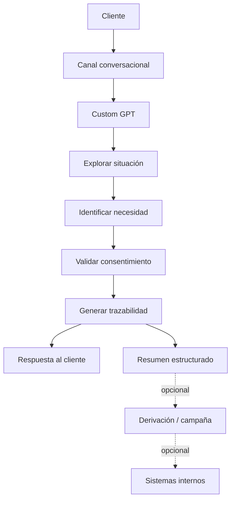

### Explicación

Esta vista resume el flujo principal de la arquitectura:

1. El cliente inicia una conversación.
2. El Custom GPT explora el caso.
3. Identifica una necesidad financiera.
4. Valida consentimiento si corresponde.
5. Genera trazabilidad, que produce dos salidas: la respuesta al cliente y un resumen estructurado.
6. Opcionalmente, el resumen se deriva a sistemas internos.

> **Nota sobre el flujo:** la trazabilidad es la fuente común de la respuesta al cliente y del resumen estructurado. Esto garantiza que ambas salidas sean consistentes entre sí.

---

## D. Diagrama de componentes

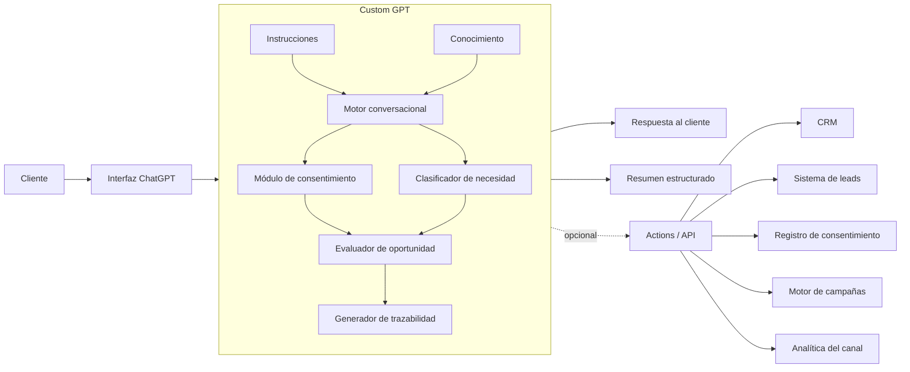

### Explicación de componentes

**Cliente.** Usuario que relata una situación financiera o pide orientación.

**Interfaz ChatGPT.** Canal donde ocurre la conversación.

**Custom GPT.** Contenedor que agrupa los módulos internos del asistente.

Dentro del Custom GPT:

- **Instrucciones:** definen el rol, el tono, las reglas y los límites del GPT.
- **Conocimiento:** documentos de referencia, como políticas, criterios de derivación y FAQs.
- **Motor conversacional:** interpreta el mensaje, hace preguntas y mantiene el hilo de la conversación.
- **Módulo de consentimiento:** gestiona la aceptación inicial y el consentimiento para derivación o contacto.
- **Clasificador de necesidad:** identifica la necesidad financiera detectada.
- **Evaluador de oportunidad:** determina si existe una oportunidad de orientación, lead o derivación.
- **Generador de trazabilidad:** produce el resumen estructurado y la respuesta al cliente de forma coherente.

Fuera del Custom GPT, las **Actions / API** permiten integraciones opcionales con sistemas externos.

---

## E. Relación entre componentes internos

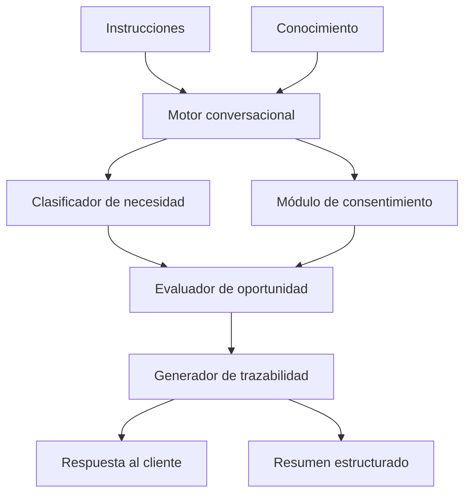

### Explicación

Este diagrama muestra cómo interactúan los módulos internos:

- Las **instrucciones** y el **conocimiento** alimentan al motor conversacional.
- El motor conversa y, a la vez, activa la **clasificación de necesidad** y el **módulo de consentimiento**.
- Ambos resultados llegan al **evaluador de oportunidad**.
- El evaluador entrega su salida al **generador de trazabilidad**, que produce de forma coherente la **respuesta al cliente** y el **resumen estructurado**.

---

## F. Flujo conversacional

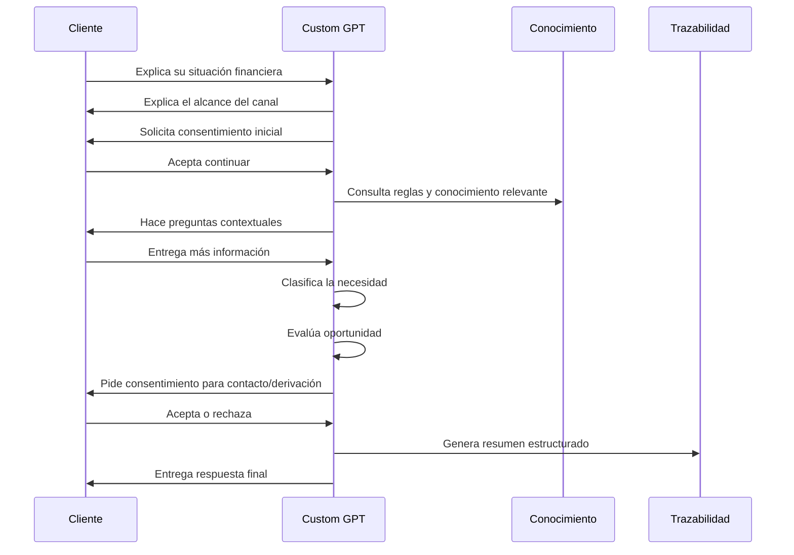

### Explicación

Este flujo muestra la conversación típica:

1. El cliente relata su situación.
2. El GPT explica el canal y pide consentimiento inicial.
3. Hace preguntas de contexto.
4. Clasifica la necesidad.
5. Evalúa si existe una oportunidad.
6. Pide consentimiento para registrar o derivar.
7. Genera trazabilidad y responde.

---

## G. Flujo de decisión sobre consentimiento

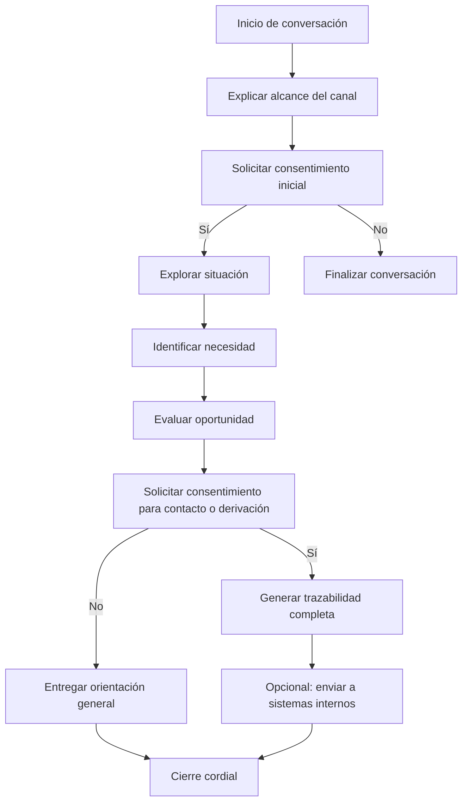

### Explicación

Este diagrama explica un punto clave del diseño:

- Si el cliente **no acepta continuar**, la conversación termina.
- Si el cliente **acepta**, el GPT explora la situación.
- Si luego el cliente **acepta contacto o derivación**, se genera trazabilidad completa.
- Si **no acepta**, se entrega solo orientación general sin registro identificable.

---

## H. Clasificación de necesidades

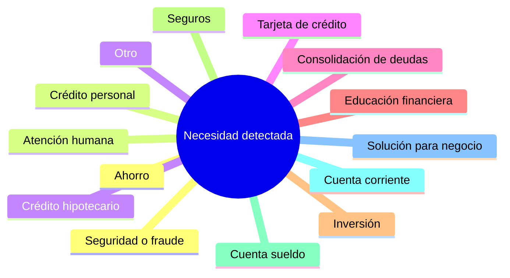

### Explicación

El GPT puede clasificar la necesidad del cliente en una o varias categorías. La clasificación no debe hacerse demasiado pronto: primero el GPT debe entender el contexto suficiente para no etiquetar erróneamente.

---

## I. Evaluación de oportunidad

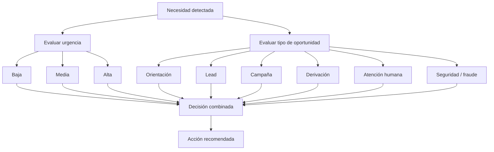

### Explicación

Después de clasificar la necesidad, el GPT evalúa dos dimensiones en paralelo:

- el **nivel de urgencia** (baja, media, alta), y
- el **tipo de oportunidad** (orientación, lead, campaña, derivación, atención humana, seguridad).

Ambas dimensiones se combinan en una **decisión combinada** que define la **acción recomendada**.

### Ejemplos de combinación

| Urgencia | Tipo de oportunidad | Acción recomendada |
|----------|---------------------|--------------------|
| Alta | Seguridad / fraude | Derivar inmediatamente a canal oficial de atención |
| Alta | Atención humana | Derivar a ejecutivo humano |
| Media | Lead | Solicitar consentimiento y registrar para contacto |
| Media | Campaña | Sugerir campaña vigente y registrar interés |
| Baja | Orientación | Entregar información general y cerrar |

> **Importante:** esto no implica aprobación de un producto. Solo identifica una posible acción de valor.

---

## J. Generación de trazabilidad

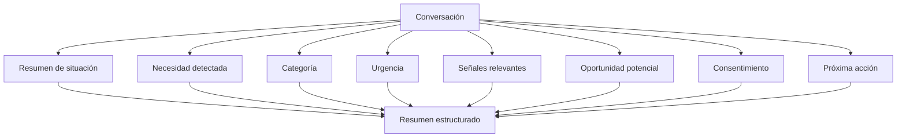

### Explicación

La trazabilidad convierte la conversación en una salida estructurada, útil para análisis del piloto, seguimiento, derivación, medición del canal o integración con sistemas internos.

### Ejemplo de resumen estructurado

```json
{
  "id_conversacion": "conv-2026-05-05-0017",
  "fecha": "2026-05-05T14:32:00-05:00",
  "resumen_situacion": "Cliente con ingresos estables busca consolidar tres deudas de tarjeta en un solo crédito.",
  "necesidad_detectada": "Consolidación de deudas",
  "categoria": "credito_personal",
  "urgencia": "media",
  "senales_relevantes": [
    "Mencionó cuotas atrasadas el último mes",
    "Tiene relación bancaria activa",
    "Solicitó información sobre tasas referenciales"
  ],
  "oportunidad_potencial": "lead",
  "consentimiento": {
    "inicial": true,
    "contacto": true,
    "fecha_aceptacion": "2026-05-05T14:35:00-05:00"
  },
  "proxima_accion": "Derivar a ejecutivo de banca personal",
  "canal_origen": "custom_gpt_piloto"
}
```

Este formato permite que el resumen sea consumido por sistemas internos sin transformación adicional.

---

## K. Manejo de casos límite

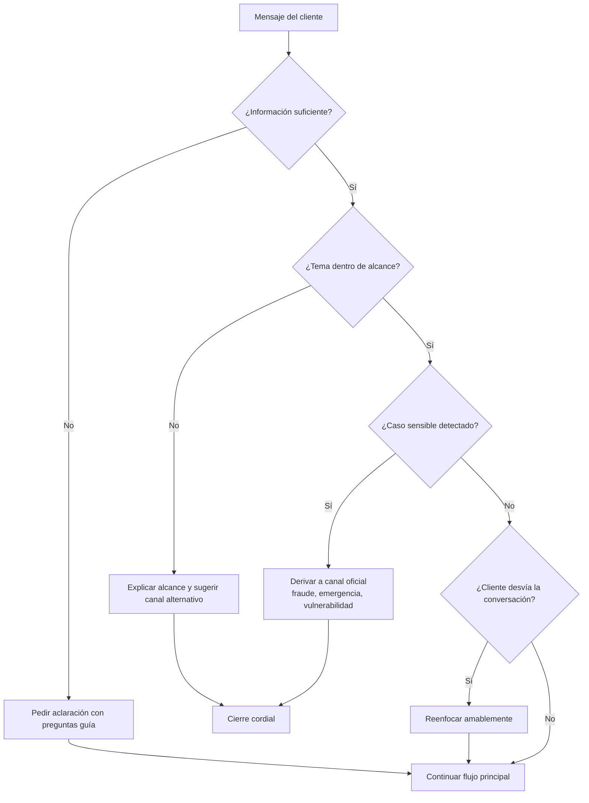

### Explicación

El GPT debe manejar explícitamente los siguientes casos:

- **Información insuficiente:** hace preguntas guía sin presionar.
- **Tema fuera de alcance:** explica el alcance del canal y sugiere una alternativa.
- **Caso sensible:** deriva a canal oficial sin intentar resolverlo en el chat.
- **Desvío de conversación:** reenfoca con amabilidad sin cortar al cliente.

Estos caminos alternativos protegen al cliente y al canal de respuestas inadecuadas.

---

## L. Integración con sistemas externos

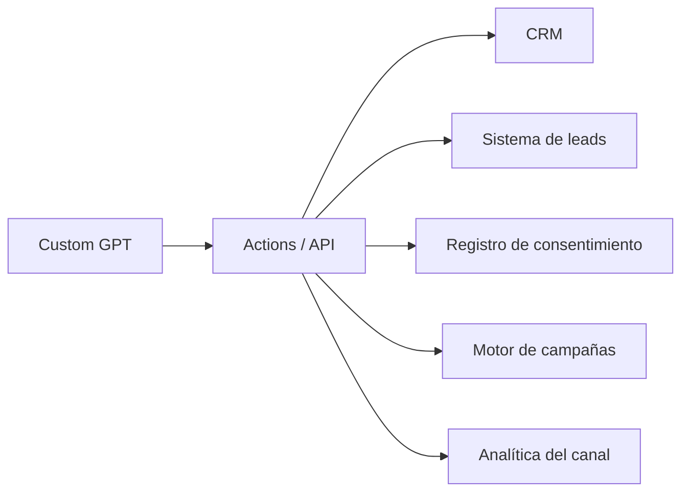

### Explicación

En una versión avanzada, el GPT puede integrarse con sistemas externos. Estas integraciones son opcionales y deberían activarse **solo cuando el flujo conversacional ya esté validado** en el piloto.

---

## M. Reglas de seguridad

### Resumen visual

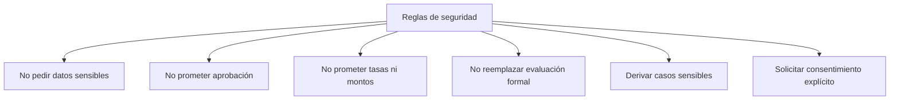

### Detalle de reglas

| Regla | Descripción | Acción si se viola |
|-------|-------------|--------------------|
| **No pedir datos sensibles** | No solicitar contraseñas, claves, PIN, tokens, códigos de seguridad ni número completo de tarjeta. | Rechazar y advertir al cliente. |
| **No prometer aprobación** | No confirmar aprobación, elegibilidad ni beneficios. | Reformular como orientación general. |
| **No prometer tasas ni montos** | No entregar tasas, montos ni rentabilidades como compromiso. | Indicar que son referenciales y sujetas a evaluación. |
| **No reemplazar evaluación formal** | Aclarar que el canal no sustituye la evaluación de un ejecutivo. | Recordar al cliente el alcance del canal. |
| **Derivar casos sensibles** | Recomendar canales oficiales en casos de fraude, robo o pérdida de tarjeta, emergencia bancaria, vulnerabilidad o atención humana. | Cortar el flujo y derivar de inmediato. |
| **Solicitar consentimiento explícito** | Pedir aceptación clara antes de continuar y antes de registrar/derivar. | No avanzar sin consentimiento. |

---

## N. Responsabilidades por componente

| Componente | Responsable de definir | Responsable de implementar | Responsable de validar |
|------------|------------------------|----------------------------|------------------------|
| Instrucciones | Negocio | Tecnología | Cumplimiento |
| Conocimiento | Negocio + Producto | Tecnología | Riesgo |
| Motor conversacional | Tecnología | Tecnología | Negocio |
| Módulo de consentimiento | Cumplimiento | Tecnología | Cumplimiento + Legal |
| Clasificador de necesidad | Negocio | Tecnología | Negocio |
| Evaluador de oportunidad | Negocio + Riesgo | Tecnología | Riesgo |
| Generador de trazabilidad | Negocio + Analítica | Tecnología | Analítica |
| Reglas de seguridad | Cumplimiento + Riesgo | Tecnología | Cumplimiento |
| Actions / API | Tecnología | Tecnología | Seguridad de la información |

Esta tabla aclara quién toma decisiones sobre cada pieza y evita zonas grises durante la implementación.

---

## O. Mapeo con el proceso de negocio (BPMN)

Esta sección cruza el modelo BPMN del proceso descrito en [I.A. Proceso Funcional](#a-proceso-funcional) con los componentes y secciones de la arquitectura conceptual. Permite que un revisor pueda navegar de un artefacto al otro sin ambigüedad.

### Actores del BPMN

| Lane BPMN | Equivalente en arquitectura |
|-----------|------------------------------|
| Banco | Operador del canal y dueño de las integraciones (II.D y II.N) |
| Cliente | Cliente que conversa (II.D) |
| IA generativa | Custom GPT y sus módulos internos (II.D y II.E) |

### Mapeo de actividades

| Actividad BPMN | Lane | Sección de arquitectura | Comentario |
|----------------|------|--------------------------|------------|
| 1.1 Habilita canal ChatGPT Custom | Banco | II.D (Diagrama de componentes) | Configuración inicial del Custom GPT, instrucciones y conocimiento. |
| 1.2 Recibe invitación experimental | Cliente | II.F (Flujo conversacional, paso 1) | Punto de entrada del cliente al canal. |
| 1.3 Acepta términos y condiciones | Cliente | II.G (Consentimiento inicial) | **Falta en el BPMN la ruta "no acepta".** Ver gap 1. |
| 2.1 Relata una situación financiera real | Cliente | II.F (paso 2) | El cliente describe libremente su situación. |
| 2.2 Explora situación mediante diálogo abierto | IA generativa | II.E (Motor conversacional) | Núcleo del comportamiento conversacional. |
| 2.3 Identifica contexto y necesidades latentes | IA generativa | II.H (Clasificación) | **Recomendado desdoblar en BPMN** para distinguir "identificar contexto" de "clasificar necesidad". |
| 3.1 Identifica oportunidades potenciales | IA generativa | II.I (Evaluación de oportunidad) | Combina urgencia y tipo de oportunidad. |
| 3.2 Entrega consentimiento para campaña o derivación | Cliente | II.G (Consentimiento para contacto) | Segundo punto de consentimiento. **Falta en el BPMN la ruta "no acepta".** Ver gap 2. |
| 3.3 Registra trazabilidad para análisis del canal | Banco | II.J (Trazabilidad) | Genera el resumen estructurado. **Falta en el BPMN el destino de la trazabilidad.** Ver gap 3. |

### Gaps detectados entre BPMN y arquitectura

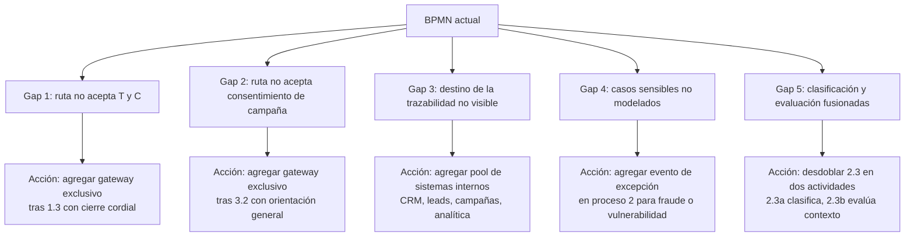

### Detalle de cada gap

**Gap 1 — Ruta de no aceptación de términos y condiciones.**
El BPMN actual asume que el cliente siempre acepta en 1.3. Debe agregarse un *gateway exclusivo* después de 1.3 con dos salidas: "Sí" continúa a 2.1, "No" finaliza el proceso con un cierre cordial.

**Gap 2 — Ruta de no aceptación de consentimiento de campaña.**
Mismo patrón en 3.2. Si el cliente no acepta el contacto, debe entregarse orientación general sin registrar datos identificables y cerrar la conversación.

**Gap 3 — Destino visible de la trazabilidad.**
La actividad 3.3 termina sin mostrar a dónde va el registro. Recomendamos agregar un pool externo (o varios *Data Stores*) que represente al menos: CRM, sistema de leads, registro de consentimiento, motor de campañas y analítica del canal. Esto deja explícita la integración descrita en II.L.

**Gap 4 — Casos sensibles no modelados.**
El BPMN no contempla situaciones como fraude, robo o pérdida de tarjeta, vulnerabilidad o solicitud explícita de atención humana. Debe agregarse un *evento de excepción* (boundary event) sobre las actividades del proceso 2 que derive el caso al canal oficial. Esto refleja II.K (Casos límite) y II.M (Reglas de seguridad).

**Gap 5 — Clasificación y evaluación fusionadas.**
La actividad 2.3 fusiona dos pasos que en la arquitectura son distintos: identificar la necesidad (II.H) y evaluar la oportunidad (II.I). Recomendamos desdoblar en dos subactividades, especialmente si se quiere medir por separado la calidad de la clasificación y la calidad de la evaluación.

### Resumen visual del proceso ajustado

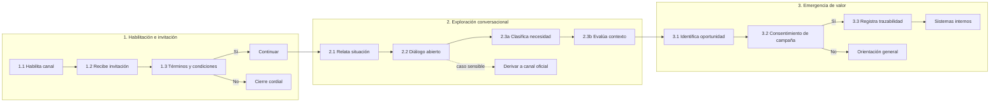

Este diagrama muestra cómo se vería el BPMN una vez incorporados los cinco gaps. Es una propuesta para alinear el modelo de negocio con los componentes técnicos descritos en esta arquitectura.

---

## P. Cierre — Componentes principales

Como cierre de la arquitectura conceptual, los componentes principales del Custom GPT son:

1. Cliente que conversa.
2. Interfaz ChatGPT.
3. Custom GPT especializado, que contiene:
   - instrucciones,
   - conocimiento,
   - motor conversacional,
   - módulo de consentimiento,
   - clasificador de necesidad,
   - evaluador de oportunidad,
   - generador de trazabilidad.
4. Salidas: respuesta al cliente y resumen estructurado.
5. Integraciones opcionales con CRM, leads, consentimiento, campañas y analítica.