# D-05259 Diagnóstico del modelo actual y propuesta de factibilidad para un Portal Venture Client BCP

**Versión:** 2.0
**Estado:** Propuesta de factibilidad para decisión
**Audiencia:** Equipo Partnership (formalmente, Venture Client), Negocio, Riesgos No Financieros, Seguridad, Data Governance, Open Economy / Open Finance, Tecnología, Arquitectura y Sponsor de la iniciativa

---

## Tabla de contenidos

* [I. Objetivo General](#i-objetivo-general)

  * [A. Proceso Funcional](#a-proceso-funcional)
* [II. Arquitectura de Referencia y Factibilidad](#ii-arquitectura-de-referencia-y-factibilidad)

  * [1. Naturaleza de la propuesta](#1-naturaleza-de-la-propuesta)
  * [2. Glosario](#2-glosario)
  * [3. Encuadre del problema — De ofimática dispersa a portal](#3-encuadre-del-problema--de-ofimática-dispersa-a-portal)
  * [4. Vista general de alto nivel](#4-vista-general-de-alto-nivel)
  * [5. Componentes principales del portal](#5-componentes-principales-del-portal)
  * [6. Relación entre componentes](#6-relación-entre-componentes)
  * [7. Flujo operativo de referencia](#7-flujo-operativo-de-referencia)
  * [8. Clasificación de partners e insumos](#8-clasificación-de-partners-e-insumos)
  * [9. Matriz conceptual de riesgos y controles](#9-matriz-conceptual-de-riesgos-y-controles)
  * [10. Trazabilidad esperada](#10-trazabilidad-esperada)
  * [11. Beneficios por stakeholder](#11-beneficios-por-stakeholder)
  * [12. Evaluación de factibilidad](#12-evaluación-de-factibilidad)
  * [13. Factibilidad tecnológica — Reutilización vs. construcción](#13-factibilidad-tecnológica--reutilización-vs-construcción)
  * [14. Riesgos de no hacer](#14-riesgos-de-no-hacer)
  * [15. Enfoque recomendado por fases](#15-enfoque-recomendado-por-fases)
  * [16. Roadmap conceptual](#16-roadmap-conceptual)
  * [17. Decisión solicitada al sponsor](#17-decisión-solicitada-al-sponsor)
  * [18. Elementos a profundizar en la etapa de diseño](#18-elementos-a-profundizar-en-la-etapa-de-diseño)

---

# I. Objetivo General

La iniciativa **D-05259** tiene como objetivo diagnosticar el modelo operativo actual del Equipo Partnership del BCP, formalmente denominado Venture Client, y sustentar la factibilidad de evolucionar hacia un **Portal Venture Client** o mecanismo digital equivalente que permita gobernar, centralizar y escalar el onboarding de partners y el intercambio de insumos para pilotos, pruebas de concepto y colaboraciones con startups.

El diagnóstico evidencia que el modelo actual depende de mecanismos ofimáticos y coordinaciones manuales: correos, archivos Excel, carpetas compartidas, documentos sueltos, reuniones e hilos de conversación. Esto permite operar en casos puntuales, pero introduce una limitación estructural cuando el modelo Venture Client busca escalar: la trazabilidad depende de quién guardó qué evidencia, las aprobaciones pueden quedar distribuidas en hilos de correo, el estado real de cada partner no siempre es visible en tiempo real y una revisión posterior puede exigir reconstruir manualmente cada caso.

La propuesta de factibilidad plantea que el banco puede capturar valor si evoluciona desde una operación basada en ofimática dispersa hacia una capa de gobierno operativo que permita registrar partners, clasificar insumos, formalizar solicitudes, documentar aprobaciones, controlar entregas y conservar evidencia auditable de extremo a extremo.

La recomendación del documento es avanzar hacia una **Fase 0 de diseño funcional y arquitectura objetivo**, acotada y orientada a MVP, para validar el alcance del Portal Venture Client, las reglas mínimas de gobierno, las capacidades corporativas reutilizables y las condiciones operativas necesarias para su implementación posterior.

---

## A. Proceso Funcional

Esta sección describe el proceso AS-IS de la gestión del Equipo Partnership asociada al onboarding de partners y al intercambio de insumos para pilotos o pruebas de concepto. Combina el modelo BPMN del proceso con una narrativa ejecutiva, de modo que el problema operativo pueda ser entendido por negocio, control, tecnología y sponsor.

### Modelo BPMN del proceso AS-IS

```mermaid
flowchart LR

subgraph P1[1. Identificación de oportunidad y partner]
  A1[1.1 Identifica oportunidad de negocio<br/><i>Equipo Partnership / Negocio</i>] --> A2[1.2 Identifica startup o partner potencial<br/><i>Equipo Partnership</i>]
  A2 --> A3[1.3 Evalúa encaje preliminar<br/><i>Equipo Partnership / Negocio</i>]
end

subgraph P2[2. Onboarding y habilitación informal]
  B1[2.1 Solicita información inicial<br/><i>Equipo Partnership</i>] --> B2[2.2 Entrega documentación<br/><i>Partner</i>]
  B2 --> B3[2.3 Coordina revisión con áreas internas<br/><i>Equipo Partnership</i>]
  B3 --> B4[2.4 Define condiciones de participación<br/><i>Banco</i>]
end

subgraph P3[3. Intercambio de insumos]
  C1[3.1 Solicita insumos para piloto<br/><i>Partner / Negocio</i>] --> C2[3.2 Evalúa sensibilidad y autorización<br/><i>Banco</i>]
  C2 --> C3[3.3 Comparte información por canal disponible<br/><i>Correo / Excel / carpeta / transferencia controlada</i>]
  C3 --> C4[3.4 Consume información en prueba de concepto<br/><i>Partner</i>]
end

subgraph P4[4. Seguimiento y reconstrucción de evidencia]
  D1[4.1 Realiza seguimiento del piloto<br/><i>Equipo Partnership / Negocio</i>] --> D2[4.2 Conserva evidencias dispersas<br/><i>Correos / archivos / actas / carpetas</i>]
  D2 --> D3[4.3 Atiende revisiones u observaciones<br/><i>Banco</i>]
end

A3 --> B1
B4 --> C1
C4 --> D1
```

### Narrativa del proceso

#### 1. Identificación de oportunidad y partner

El proceso inicia cuando el Equipo Partnership, en coordinación con un área de negocio, identifica una oportunidad de innovación, eficiencia, generación de ingresos, reducción de costos o mejora operacional. A partir de esa oportunidad se identifica una startup o partner potencial que podría aportar una solución, tecnología o capacidad relevante para el banco.

En esta etapa, la evaluación se concentra principalmente en el encaje de negocio y en la viabilidad preliminar de colaboración. Sin embargo, el encaje de negocio no equivale necesariamente a una habilitación formal para recibir información, documentación técnica, datos de prueba o insumos del banco.

#### 2. Onboarding y habilitación informal

Una vez identificado el partner, el Equipo Partnership solicita información inicial para entender su perfil, capacidades, documentación, madurez, restricciones y condiciones de participación. En el AS-IS, esta información puede recibirse por correo, archivos adjuntos, documentos compartidos o coordinaciones puntuales.

El dolor operativo aparece cuando cada caso requiere reconstruir qué documentación fue solicitada, qué versión fue recibida, quién la revisó, qué observaciones se levantaron y qué condiciones quedaron vigentes. El proceso puede funcionar para pocos casos, pero se vuelve frágil cuando el número de partners, pilotos y áreas involucradas aumenta.

#### 3. Intercambio de insumos para piloto

Cuando el piloto requiere que el partner reciba insumos, datos, documentación, archivos, especificaciones o información del banco, se activa una evaluación de sensibilidad y autorización. En el AS-IS, esta evaluación no siempre se apoya en una taxonomía única de insumos ni en una matriz homogénea de canales permitidos.

En la práctica, algunos intercambios se resuelven mediante correos electrónicos o archivos Excel; otros mediante carpetas compartidas; otros mediante mecanismos más controlados como canales de transferencia. Esta heterogeneidad genera reprocesos, discusiones repetidas y dificultad para demostrar que cada entrega estuvo alineada con el nivel de sensibilidad del insumo, la finalidad del piloto y el estado de habilitación del partner.

#### 4. Seguimiento, evidencia y revisión

Durante la ejecución del piloto, el Equipo Partnership y las áreas involucradas realizan seguimiento, coordinan ajustes y atienden solicitudes adicionales. El problema es que la evidencia queda distribuida entre correos, reuniones, archivos, aprobaciones puntuales y repositorios no integrados.

Ante una revisión de Riesgos No Financieros, Seguridad, Data, Auditoría u Open Finance, el banco puede verse obligado a reconstruir manualmente el caso: quién solicitó, quién aprobó, qué se entregó, cuándo se entregó, por qué canal, bajo qué restricciones, con qué vigencia y si el partner estaba habilitado para recibir esa información.

### Dolor operativo principal

El AS-IS no solo genera ineficiencia. También introduce riesgo operativo y limita la escalabilidad del modelo Venture Client. Los principales dolores son:

* No existe una vista única y actualizada del estado de cada partner.
* Las aprobaciones pueden quedar distribuidas en correos, reuniones o documentos no centralizados.
* La evidencia depende de prácticas manuales y de la disciplina de cada equipo.
* La clasificación de insumos no siempre es homogénea entre casos.
* El canal de entrega puede variar según disponibilidad, urgencia o criterio operativo.
* Las áreas de control reciben casos para revisión, pero no siempre cuentan con evidencia estructurada.
* El costo de coordinar nuevos partners puede incentivar trabajar con actores ya conocidos, reduciendo la capacidad de expansión ordenada del ecosistema.

---

# II. Arquitectura de Referencia y Factibilidad

Esta sección presenta una arquitectura de referencia para evaluar la factibilidad del Portal Venture Client. No se plantea como una arquitectura cerrada, sino como un marco práctico para demostrar que el proceso puede modelarse, que existen componentes formalizables y que el banco puede avanzar hacia una solución incremental, gobernada y reutilizando capacidades existentes.

---

## 1. Naturaleza de la propuesta

El Portal Venture Client debe entenderse como una **capa de gobierno operativo**, no como un simple repositorio de archivos. Su propósito es ordenar el ciclo completo de relación con partners: registro, onboarding, habilitación, solicitud de insumos, evaluación de sensibilidad, aprobación, entrega controlada, seguimiento, evidencia y trazabilidad.

### Implicancias del enfoque

| Aspecto                                      | Implicancia                                                                                                                                 |
| -------------------------------------------- | ------------------------------------------------------------------------------------------------------------------------------------------- |
| **Propósito principal**                      | Gobernar el onboarding y el intercambio de insumos con partners.                                                                            |
| **Valor operativo**                          | Reducir fricción, reprocesos, coordinaciones manuales y discusiones repetitivas.                                                            |
| **Valor de control**                         | Centralizar autorizaciones, evidencias y trazabilidad de extremo a extremo.                                                                 |
| **Escalabilidad**                            | Permitir que el modelo Venture Client crezca sin depender de decisiones caso por caso.                                                      |
| **Relación con riesgos**                     | Facilitar revisiones de RNF, Seguridad, Data, Auditoría y otras áreas de control.                                                           |
| **Relación con Open Economy / Open Finance** | Diferenciar información compartida para pilotos de activos informacionales sujetos a esquemas distintos de consumo, control o monetización. |

---

## 2. Glosario

| Término                         | Definición                                                                                                                           |
| ------------------------------- | ------------------------------------------------------------------------------------------------------------------------------------ |
| **Venture Client**              | Modelo mediante el cual el banco colabora con startups o partners para validar soluciones, ejecutar pilotos y acelerar innovación.   |
| **Partner**                     | Startup, empresa o tercero externo que participa en una iniciativa, piloto o prueba de concepto con el banco.                        |
| **Postulante**                  | Actor externo que se encuentra en evaluación preliminar antes de ser habilitado como partner.                                        |
| **Onboarding**                  | Proceso de registro, evaluación, validación y habilitación de un partner para participar en iniciativas del banco.                   |
| **Insumo**                      | Información, documento, dato, archivo, especificación, muestra o recurso que el banco entrega o recibe para ejecutar una iniciativa. |
| **Habilitación**                | Estado que determina si un partner puede participar en una iniciativa o recibir determinados tipos de información.                   |
| **Autorización**                | Aprobación explícita de una solicitud de intercambio o entrega de información.                                                       |
| **Trazabilidad**                | Registro estructurado del flujo completo, incluyendo solicitud, evaluación, aprobación, entrega, descarga, consumo y cierre.         |
| **Evidencia**                   | Soporte verificable de una acción, aprobación, entrega o decisión tomada durante el proceso.                                         |
| **RNF**                         | Riesgos No Financieros, incluyendo riesgos operacionales, tecnológicos, de terceros, seguridad, cumplimiento u otros aplicables.     |
| **Open Economy / Open Finance** | Capacidades o iniciativas asociadas al intercambio, consumo o exposición controlada de información en ecosistemas abiertos.          |

---

## 3. Encuadre del problema — De ofimática dispersa a portal

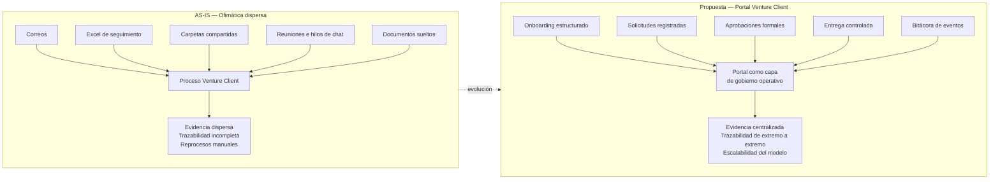

### Explicación

El argumento central de factibilidad nace del AS-IS: el Equipo Partnership opera hoy con una combinación de correos, Excel, carpetas, reuniones y documentos sueltos. Esta forma de operar puede ser suficiente para resolver pilotos aislados, pero no es una base sólida para escalar un modelo de innovación abierta con múltiples partners, múltiples áreas de control y distintos niveles de sensibilidad de información.

El Portal Venture Client permitiría convertir esos intercambios dispersos en un flujo gobernado, donde cada solicitud, aprobación, entrega y consumo deje evidencia trazable.

---

## 4. Vista general de alto nivel

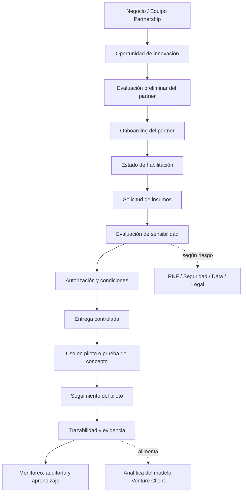

### Explicación

La vista de alto nivel muestra el flujo objetivo que debería evaluarse en la siguiente etapa de diseño. El proceso inicia con una oportunidad de negocio, continúa con evaluación y onboarding del partner, define su estado de habilitación, controla las solicitudes de insumos y registra evidencia de cada entrega o consumo.

La trazabilidad no aparece únicamente al cierre. Debe acompañar cada etapa para que el banco pueda reconstruir el caso completo cuando se requiera revisión, auditoría, análisis de riesgo o aprendizaje operativo.

---

## 5. Componentes principales del portal

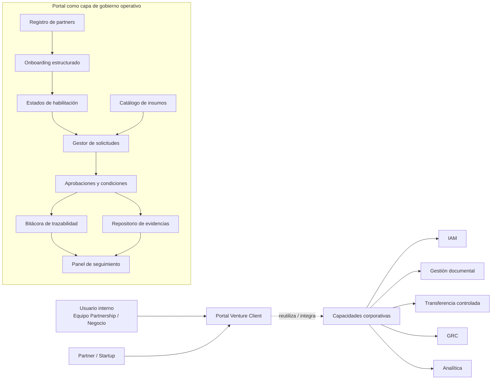

### Explicación

Los componentes principales permiten ordenar el problema sin sobredimensionar la solución. El portal debe concentrarse inicialmente en registrar partners, estructurar onboarding, definir estados de habilitación, clasificar insumos, gestionar solicitudes, registrar aprobaciones y conservar evidencia trazable.

Las capacidades corporativas existentes pueden reutilizarse o integrarse de forma progresiva, evitando construir desde cero funciones que el banco ya tiene resueltas en otras plataformas.

---

## 6. Relación entre componentes

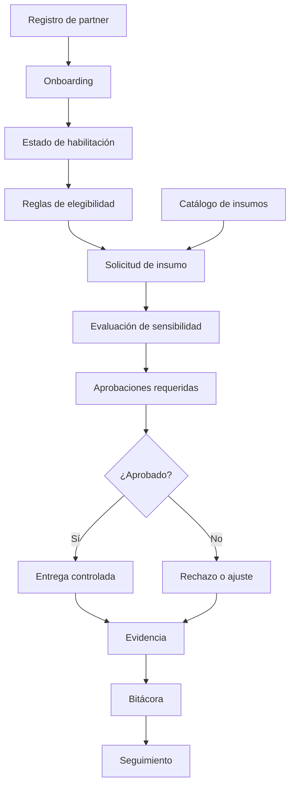

### Explicación

La relación entre componentes muestra que el portal no debe funcionar como una carga documental adicional, sino como un flujo operativo. Cada etapa habilita o restringe la siguiente. El partner debe tener un estado de habilitación; el insumo debe estar clasificado; la solicitud debe tener finalidad; la aprobación debe estar documentada; y la entrega debe quedar registrada.

---

## 7. Flujo operativo de referencia

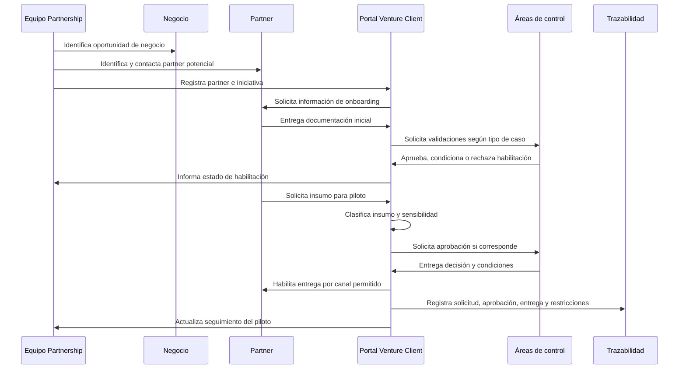

### Explicación

El flujo de referencia conserva la agilidad del Equipo Partnership, pero introduce gobierno y evidencia. La coordinación con áreas de control deja de depender únicamente de correos o reuniones y pasa a quedar registrada como parte del ciclo de vida de cada solicitud.

---

## 8. Clasificación de partners e insumos

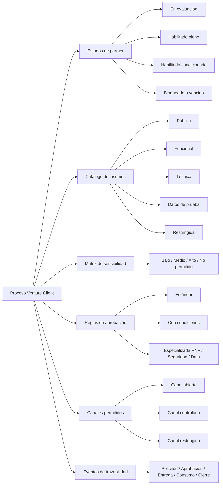

### Explicación

La factibilidad funcional se sostiene en que el proceso sí tiene elementos modelables. Es posible definir estados de partner, tipos de insumo, niveles de sensibilidad, reglas de aprobación, canales permitidos y eventos de trazabilidad.

Esto no implica que todas las reglas estén maduras hoy. Implica que existe suficiente estructura para formalizarlas durante una fase de diseño funcional.

---

## 9. Matriz conceptual de riesgos y controles

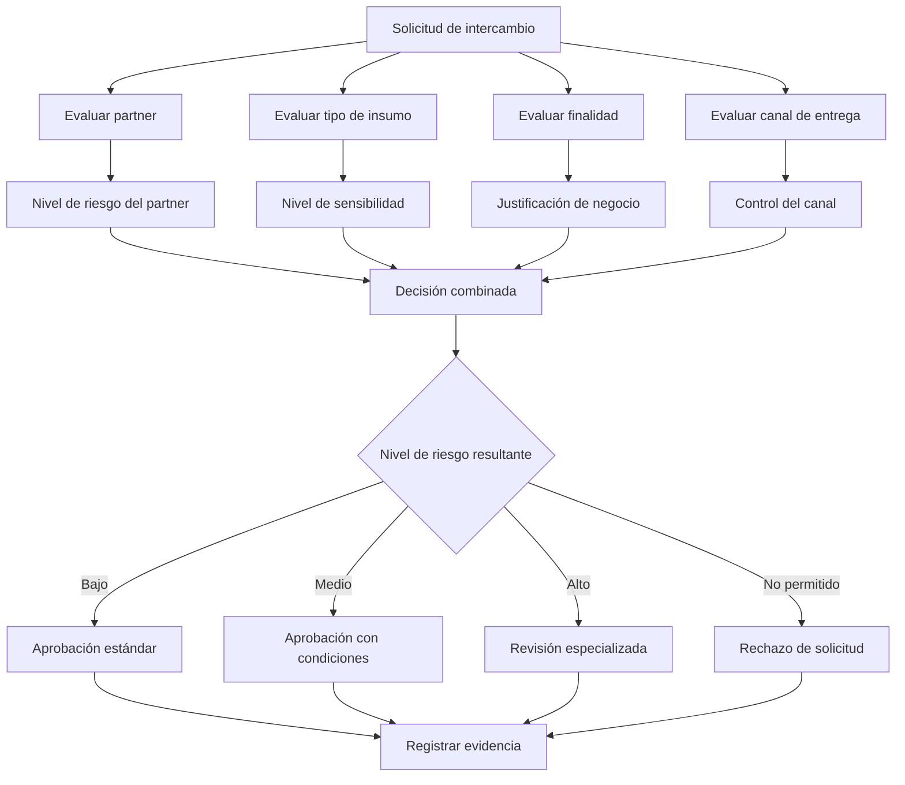

### Explicación

La evaluación de riesgo no debe depender únicamente del canal de entrega. Debe considerar el estado del partner, el tipo de insumo, la finalidad de uso y el mecanismo de intercambio. La decisión final debe producir una acción clara: aprobación estándar, aprobación condicionada, revisión especializada o rechazo.

### Ejemplos de decisión

| Estado / riesgo del partner | Sensibilidad del insumo     | Canal solicitado              | Acción recomendada                        |
| --------------------------- | --------------------------- | ----------------------------- | ----------------------------------------- |
| Habilitado                  | Pública                     | Correo o repositorio estándar | Aprobación estándar                       |
| Habilitado condicionado     | Funcional o técnica         | Repositorio controlado        | Aprobación con condiciones                |
| Habilitado condicionado     | Datos anonimizados          | Mecanismo controlado          | Revisión de Data y Seguridad              |
| En evaluación               | Cualquier insumo no público | Cualquier canal               | Bloquear solicitud y completar onboarding |
| No habilitado               | Información restringida     | Cualquier canal               | Rechazo o revisión especializada          |

---

## 10. Trazabilidad esperada

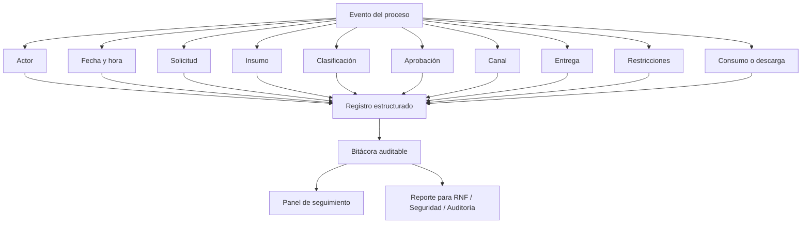

### Explicación

La trazabilidad esperada permite responder de forma directa preguntas que hoy pueden requerir reconstrucción manual: quién solicitó, quién aprobó, qué se entregó, cuándo, por qué canal, con qué restricciones, con qué vigencia y bajo qué estado de habilitación del partner.

### Ejemplo de registro estructurado

```json
{
  "id_solicitud": "vc-2026-00041",
  "partner": {
    "id_partner": "partner-017",
    "nombre": "Startup ejemplo",
    "estado_habilitacion": "habilitado_condicionado"
  },
  "iniciativa": {
    "id_iniciativa": "piloto-venture-023",
    "area_negocio": "Banca Digital",
    "responsable_banco": "Venture Client"
  },
  "insumo_solicitado": {
    "tipo": "datos_de_prueba",
    "clasificacion": "anonimizado",
    "finalidad": "Validar modelo de recomendación en ambiente controlado"
  },
  "evaluacion": {
    "sensibilidad": "media",
    "riesgo_resultante": "medio",
    "aprobaciones_requeridas": ["Data", "Seguridad"],
    "decision": "aprobado_con_condiciones"
  },
  "entrega": {
    "canal": "mecanismo_controlado",
    "fecha_entrega": "2026-05-05T15:20:00-05:00",
    "restricciones": [
      "uso exclusivo para piloto",
      "prohibida redistribución",
      "vigencia de acceso 30 días"
    ]
  },
  "evidencia": {
    "registro_aprobacion": true,
    "registro_entrega": true,
    "registro_descarga": true
  }
}
```

---

## 11. Beneficios por stakeholder

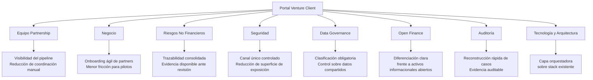

### Explicación

Las áreas de control no deben posicionarse únicamente como aprobadores o bloqueadores del portal. Son beneficiarios directos. RNF gana trazabilidad consolidada; Seguridad gana reducción de superficie de exposición; Data Governance gana clasificación obligatoria; Open Finance gana diferenciación frente a activos informacionales abiertos; Auditoría gana reconstrucción rápida de casos; Tecnología y Arquitectura ganan una capa orquestadora que puede apoyarse en capacidades existentes.

---

## 12. Evaluación de factibilidad

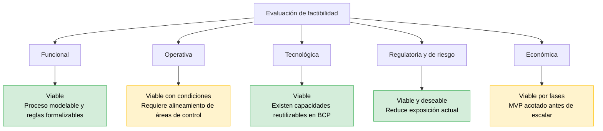

### Lectura por dimensión

| Dimensión                   | Evaluación             | Sustento                                                                                                                                      |
| --------------------------- | ---------------------- | --------------------------------------------------------------------------------------------------------------------------------------------- |
| **Funcional**               | Viable                 | El proceso puede modelarse mediante estados, solicitudes, reglas, aprobaciones, canales y eventos de trazabilidad.                            |
| **Operativa**               | Viable con condiciones | Requiere dueños claros, acuerdos de operación y participación activa del Equipo Partnership, negocio y áreas de control.                      |
| **Tecnológica**             | Viable                 | No requiere partir de cero si se reutilizan capacidades corporativas como IAM, gestión documental, transferencia controlada, GRC y analítica. |
| **Regulatoria y de riesgo** | Viable y deseable      | El portal reduce riesgos ya existentes en el AS-IS: evidencia dispersa, falta de trazabilidad y variabilidad operativa.                       |
| **Económica**               | Viable por fases       | Se recomienda iniciar con diseño y MVP acotado, evitando una construcción completa antes de validar adopción y valor.                         |

### Conclusión de factibilidad

La evaluación preliminar sugiere que el Portal Venture Client es factible y conveniente como evolución del modelo operativo actual. La recomendación es no iniciar con una implementación completa, sino con una fase de diseño funcional y arquitectura objetivo que permita delimitar un MVP, validar reglas, confirmar capacidades reutilizables y estimar esfuerzo con mayor precisión.

---

## 13. Factibilidad tecnológica — Reutilización vs. construcción

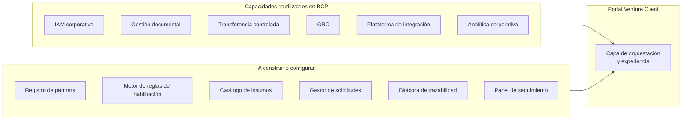

### Explicación

El portal no debe concebirse como una plataforma monolítica ni como una construcción aislada. El enfoque recomendado es reutilizar capacidades corporativas y construir únicamente la capa específica de orquestación Venture Client.

Esto reduce el costo percibido del proyecto, facilita aprobación interna y permite que Tecnología y Arquitectura participen como habilitadores del modelo, no solo como responsables de una nueva construcción.

---

## 14. Riesgos de no hacer

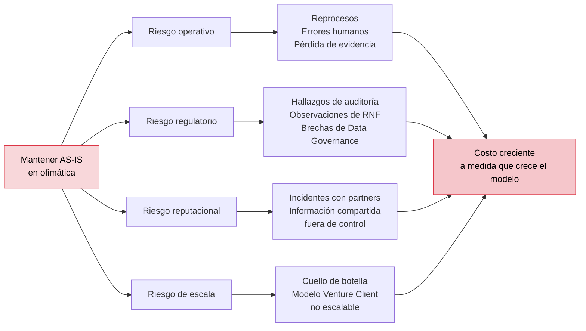

### Explicación

Mantener el AS-IS no es una decisión neutral. Si el modelo Venture Client escala sin una capa de gobierno, el banco asume un costo creciente de coordinación, reconstrucción de evidencia y exposición a observaciones. El riesgo aumenta con cada nuevo partner, piloto e intercambio de información.

Los riesgos más relevantes son operativos, regulatorios, reputacionales y de escala. El modelo podría convertirse en un cuello de botella o, peor aún, en una fuente de incidentes si la información se comparte sin trazabilidad suficiente.

---

## 15. Enfoque recomendado por fases

```mermaid
flowchart LR

subgraph F0[Fase 0 — Diseño]
  A1[Diseño funcional]
  A2[Arquitectura objetivo]
  A3[Definición de reglas]
end

subgraph F1[Fase 1 — MVP]
  B1[Registro de partners]
  B2[Onboarding básico]
  B3[Solicitud y aprobación]
  B4[Bitácora mínima]
end

subgraph F2[Fase 2 — Consolidación]
  C1[Motor de reglas]
  C2[Catálogo de insumos]
  C3[Repositorio de evidencias]
  C4[Panel de seguimiento]
end

subgraph F3[Fase 3 — Integración]
  D1[Integración con GRC]
  D2[Integración con IAM]
  D3[Integración con transferencia controlada]
  D4[Analítica del modelo]
end

F0 --> F1
F1 --> F2
F2 --> F3
```

### Explicación

La iniciativa debe abordarse incrementalmente. La Fase 0 debe producir el diseño funcional, la arquitectura objetivo y las reglas mínimas. La Fase 1 debe validar un MVP con registro de partners, onboarding básico, solicitud, aprobación y bitácora mínima. La Fase 2 debe consolidar reglas, catálogo, evidencias y seguimiento. La Fase 3 debe incorporar integraciones corporativas más profundas.

Este enfoque permite capturar valor temprano, reducir riesgo económico y evitar una implementación sobredimensionada antes de validar adopción.

---

## 16. Roadmap conceptual

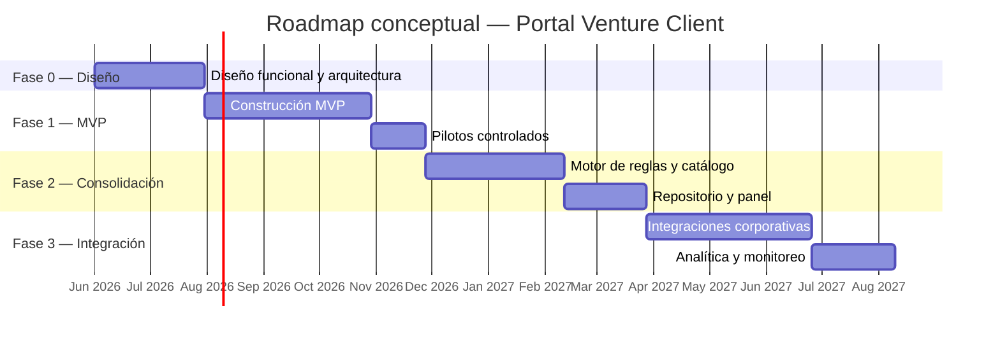

### Explicación

El roadmap es conceptual y debe validarse en la Fase 0. Su objetivo es mostrar que la iniciativa puede ejecutarse por etapas, con decisiones intermedias, validación de valor y control del esfuerzo.

---

## 17. Decisión solicitada al sponsor

La decisión solicitada no es aprobar la construcción completa del Portal Venture Client. La decisión solicitada es aprobar una **Fase 0 de diseño funcional y arquitectura objetivo**, con participación del Equipo Partnership, negocio, RNF, Seguridad, Data, Open Finance, Tecnología y Arquitectura.

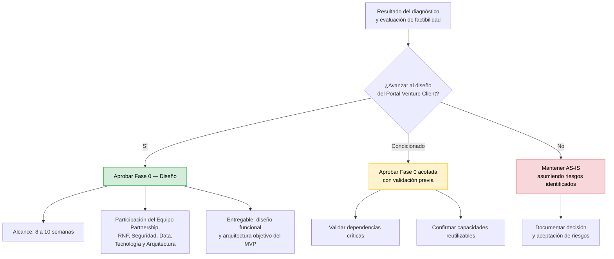

### Recomendación

Se recomienda aprobar la **Fase 0 — Diseño**, con alcance de 8 a 10 semanas, orientada a definir:

1. Diseño funcional del proceso objetivo.
2. Arquitectura objetivo del MVP.
3. Estados de partner y reglas de habilitación.
4. Catálogo inicial de insumos y matriz de sensibilidad.
5. Flujo de aprobación por nivel de riesgo.
6. Evidencia mínima obligatoria por tipo de solicitud.
7. Capacidades corporativas a reutilizar.
8. Estimación de esfuerzo para MVP.

---

## 18. Elementos a profundizar en la etapa de diseño

Los siguientes elementos deben abordarse en la etapa de diseño, no como precondición para reconocer la factibilidad, sino como entregables de la Fase 0:

| Elemento                         | Objetivo en Fase 0                                                                                |
| -------------------------------- | ------------------------------------------------------------------------------------------------- |
| **Responsabilidades detalladas** | Confirmar owners funcionales, técnicos y de control por componente.                               |
| **Reglas de gobierno completas** | Formalizar reglas de habilitación, clasificación, aprobación, vigencia y excepción.               |
| **Integraciones específicas**    | Determinar qué capacidades corporativas se reutilizan y en qué secuencia.                         |
| **Modelo de datos**              | Definir entidades mínimas: partner, iniciativa, solicitud, insumo, aprobación, evidencia, evento. |
| **MVP funcional**                | Precisar alcance mínimo para validar valor sin sobredimensionar la solución.                      |
| **Métricas de éxito**            | Definir indicadores de reducción de reproceso, tiempo de onboarding, trazabilidad y cumplimiento. |

### Cierre

El diagnóstico AS-IS muestra que el modelo actual permite operar, pero no ofrece una base suficientemente robusta para escalar el modelo Venture Client con trazabilidad, evidencia y control consistentes. La propuesta de un Portal Venture Client es factible porque el proceso es modelable, las reglas pueden formalizarse, existen capacidades tecnológicas reutilizables y las áreas de control se benefician directamente de una operación más trazable.

La recomendación es avanzar a una Fase 0 de diseño funcional y arquitectura objetivo para convertir esta factibilidad en un MVP concreto, priorizado y gobernado.
